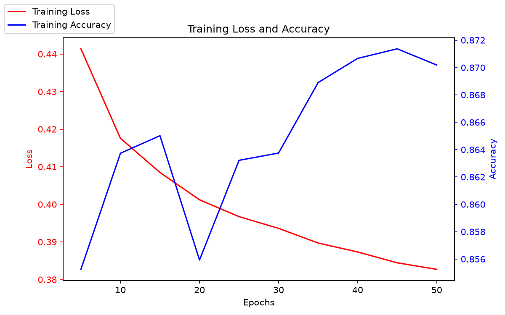
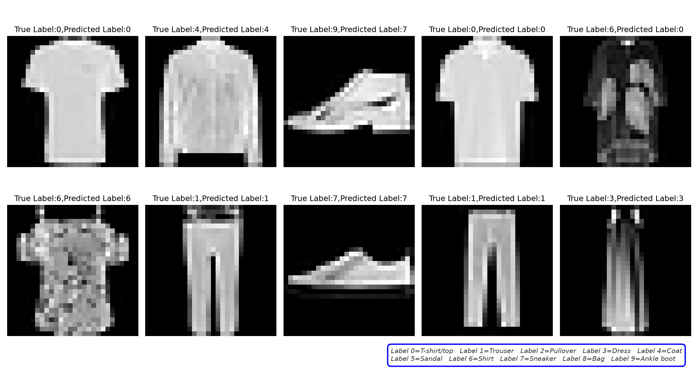

# 使用 NumPy 实现 Fashion-MNIST Softmax 分类

本项目使用 NumPy 从零实现 Softmax 回归模型，并在 Fashion-MNIST 数据集上完成训练和测试。模型计算与训练过程不依赖 PyTorch 或 TensorFlow 等深度学习框架；`torchvision` 仅用于下载和读取数据集。

项目通过手写 Softmax、交叉熵损失、反向传播和梯度下降，将数学公式完整转换为可运行代码，以加深对神经网络训练底层原理的理解。

## 实现内容

- **模型**：线性模型与 Softmax 激活组成的多分类模型
- **前向传播**：`Z = X @ W + b`，经过 Softmax 得到类别概率
- **损失函数**：交叉熵损失 `L = -mean(log(probs[true_class]))`
- **反向传播**：手动实现交叉熵与 Softmax 的联合梯度 `dZ = (probs - y_onehot) / N`
- **优化方法**：小批量随机梯度下降
- **结果展示**：绘制训练损失、训练准确率和测试集预测样例

## 主要参数

| 参数 | 数值 |
| --- | ---: |
| 训练轮数 | 50 |
| 批次大小 | 64 |
| 学习率 | 0.1 |
| 类别数量 | 10 |

## 项目结构

```text
Numpy-Softmax-FashionMNIST/
├── README.md
├── softmax_numpy.py
├── task1加载数据.py
├── task2实现Softmax函数.py
├── task3实现交叉熵损失函数.py
├── task4阶段一回顾.py
├── task5实现前向传播.py
├── task6实现反向传播的梯度计算.py
├── task7实现不含批次的完整训练.py
├── task8添加批次训练.py
├── task9可视化.py
├── training_curves.png
└── sample_predictions.png
```

其中，`task*.py` 是按学习顺序拆分的阶段性练习脚本，`softmax_numpy.py` 是整合所有步骤后的完整可运行版本。

## 运行项目

### 环境要求

- Python 3.14
- NumPy
- Matplotlib
- torchvision

### 操作步骤

1. 克隆仓库并进入项目目录：

   ```bash
   git clone https://github.com/lxxxxy798/nndl-playground.git
   cd nndl-playground/completed/Numpy-Softmax-FashionMNIST
   ```

2. 安装依赖：

   ```bash
   pip install numpy matplotlib torchvision
   ```

3. 运行完整训练程序：

   ```bash
   python softmax_numpy.py
   ```

训练结束后，程序会在控制台输出测试准确率，并生成训练曲线和预测结果图片。

## 实验结果

十次测试中的结果范围如下。由于权重采用随机初始化，且每轮训练都会打乱样本，因此每次运行结果会有一定浮动。

| 指标 | 结果范围 |
| --- | ---: |
| 训练准确率 | 82.51%–87.20% |
| 测试准确率 | 82.83%–84.53% |

### 训练曲线



### 预测结果样例



## 项目收获

通过这个项目，我掌握了：

1. 将数学公式转换为 NumPy 代码的完整过程
2. 交叉熵与 Softmax 联合梯度的推导和实现
3. 小批量梯度下降训练循环的实现方法
4. 使用损失曲线、准确率和预测样例评估模型的方法

## 作者信息

- 学校：西南大学计算机与信息科学学院 软件学院
- 专业：计算机科学与技术（中外合作办学）
- 作者：陆熙悦
- 邮箱：swulxxxxy@email.swu.edu.cn

---

[← 返回已完成项目](../)
